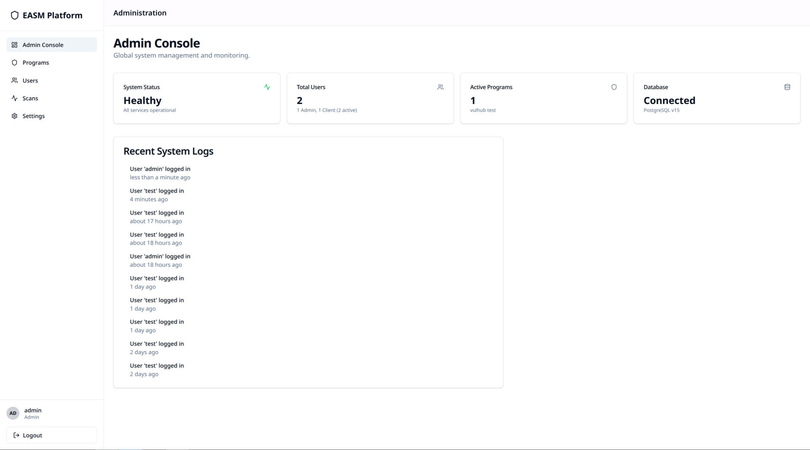
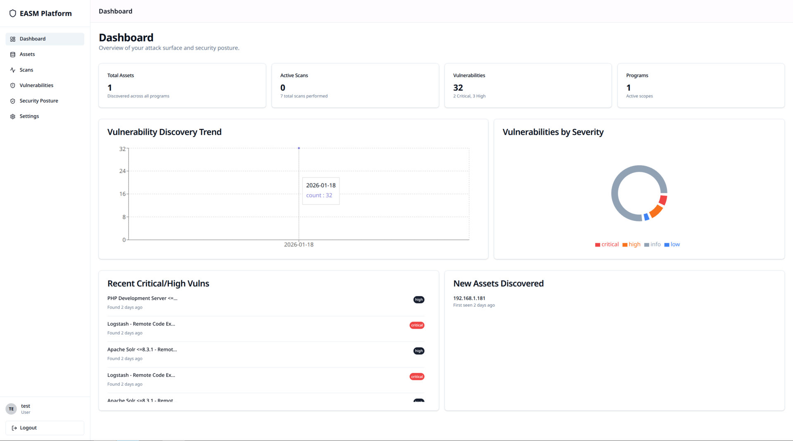
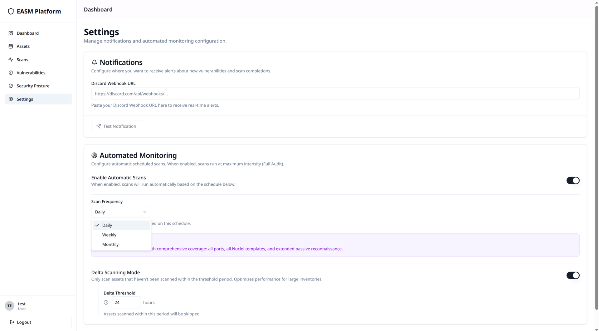
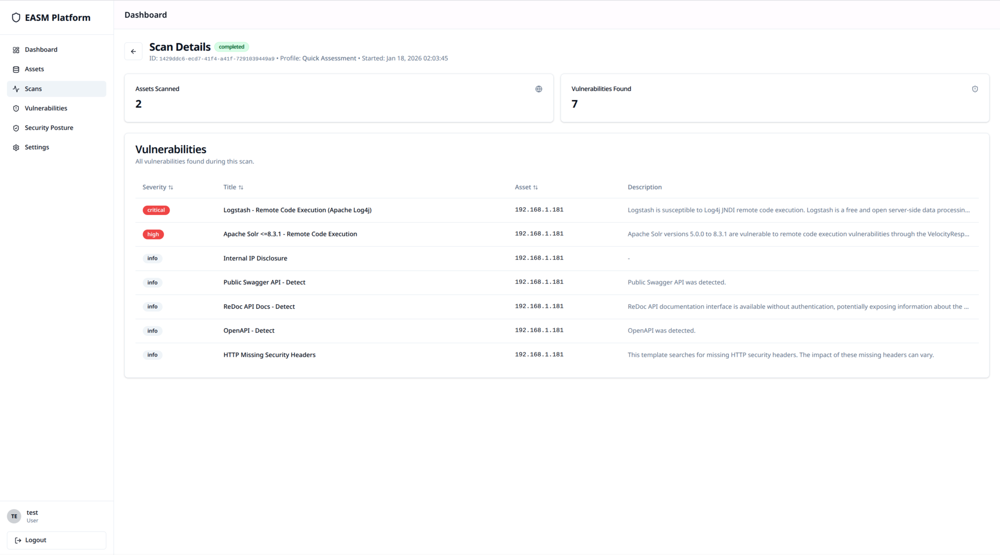

# EASM (External Attack Surface Management)

Plateforme complète de gestion de la surface d'attaque externe, conçue pour automatiser la découverte, le scan et la surveillance des actifs exposés (domaines, sous-domaines, IPs, services) et détecter les vulnérabilités.

## Fonctionnalités

### Profils de Scan

| Profil | Description | Durée Estimée |
|--------|-------------|---------------|
| **Discovery** | Reconnaissance passive uniquement | 2-5 min |
| **Quick Assessment** | Scan rapide pour vulnérabilités les plus évidentes (80% des vulns en 20% du temps) | 5-15 min |
| **Standard Assessment** | Approche équilibrée | 15-45 min |
| **Full Audit** | Scan exhaustif : tous les templates Nuclei + recon passive étendue. | 1-4 heures |

### Phases de scan

Les scans s'exécutent en plusieurs phases séquentielles :

1. **Asset Discovery** : Découverte des sous-domaines via **Subfinder** et outils complémentaires (amass, assetfinder...).

2. **Service Enumeration** : Port scanning ultra-rapide via **Naabu** pour identifier les services exposés sur les actifs découverts.

3. **Technology Detection** : Analyse des services via **httpx** pour identifier les technologies (serveur web, WAF, CMS, frameworks, bibliothèques JS) et configuration TLS/SSL.

4. **Vulnerability Assessment** : Scan ciblé via **Nuclei** avec templates prioritaires sélectionnés dynamiquement selon les technologies détectées (CVEs connues, misconfigurations, fichiers exposés, panels admin, vulnérabilités web classiques).

5. **Deep Analysis** *(Full Audit uniquement)* : Scan exhaustif avec l'ensemble des templates Nuclei communautaires pour une couverture maximale.

**Streaming Temps Réel** : Les vulnérabilités sont transmises instantanément au backend dès leur découverte pour un affichage live dans le dashboard.

### Passive Intelligence

Collecte étendue de données OSINT pour chaque actif :

- **DNS Records** : Énumération complète des enregistrements A, AAAA, MX, TXT, NS, SOA, CNAME, PTR via dnsx.
- **WHOIS** : Informations d'enregistrement de domaine (registrar, dates, serveurs de noms, registrant).
- **Certificates** : Certificats SSL/TLS depuis les logs CT (crt.sh) et analyse directe via tlsx.
- **ASN Information** : Renseignement sur les systèmes autonomes (numéro, nom, pays, préfixe BGP).
- **Reverse DNS** : Résolution PTR pour la découverte d'hostnames associés aux IPs.
- **Historical URLs** : URLs historiques depuis Wayback Machine et GAU (GetAllUrls).
- **Security Headers** : Analyse des headers de sécurité HTTP avec score et grade (CSP, HSTS, X-Frame, etc.).
- **Favicon Hash** : Calcul du hash MMH3 pour fingerprinting Shodan.
- **Crawled Endpoints** : Découverte d'endpoints via **Katana** avec classification JS/API.
- **Cloud Assets** : Détection des actifs AWS, Azure et GCP potentiellement publics.

#### API Intégrations (Optionnel)

Intégration avec les services de renseignement payant :

- **Shodan** : Données d'infrastructure, ports ouverts, vulnérabilités, tags.
- **SecurityTrails** : Historique DNS et sous-domaines découverts.
- **Censys** : Données de certificats et services détectés.
- **HackerTarget** : Outils de reconnaissance gratuits (API free tier).

Chaque programme peut configurer ses propres clés API, chiffrées au repos avec Fernet.

### Gestion & Suivi (Dashboard)

- **Programmes** : Création et isolation des audits par "Programme" (ex: Bug Bounty, Client X, Interne). Chaque programme possède sa propre configuration de scan.
- **Scopes** : Définition de cibles multiples par programme avec support des domaines, hostnames et plages IP. Notation optionnelle Cible:Port pour les scans dirigés.
- **Inventaire** : Vue centralisée de tous les actifs découverts (IPs, Domaines, Technologies détectées, services, headers de sécurité).
- **Asset Criticality** : Classification des actifs par niveau de criticité (Critical, High, Medium, Low, Unclassified). La criticité influence l'intensité du scan.
- **Suivi des Scans** : Monitoring en temps réel de l'avancement des tâches (Discovery, Port Scan, Tech Detection, Vuln Scan). Reprise automatique des scans interrompus au démarrage de la plateforme.
- **Delta Scanning** : Mode optionnel permettant de ne scanner que les actifs "stale" (non scannés depuis un seuil configurable, par défaut 24 heures).
- **Reporting** : Visualisation détaillée des vulnérabilités avec preuves (requête/réponse HTTP) et suggestions de remédiation.
- **Export CSV** : Export des vulnérabilités au format CSV pour analyse externe.

### Compliance Mapping (BETA)

Analyse des vulnérabilités détectées contre les cadres de conformité :

- **ISO 27001:2022** : 14 contrôles couvrant les aspects organisationnels et technologiques.
- **SOC 2 Type II** : 16 critères relatifs à l'environnement de contrôle, la sécurité, la disponibilité et la confidentialité.
- **NIST CSF 2.0** : 35 fonctions et catégories (Govern, Identify, Protect, Detect, Respond, Recover).
- **PCI-DSS 4.0** : 31 exigences pour la protection des données de paiement.

Pour chaque vulnérabilité détectée, la plateforme identifie automatiquement les contrôles affectés et calcule un score de conformité.

### Notifications & Automatisation

- **Discord Webhooks** : Alerting en temps réel lors de la découverte de vulnérabilités critiques.
- **Scheduled Scans** : Planification automatique des analyses selon une fréquence configurable.
- **Scan Resumption** : Reprise automatique des scans interrompus par un crash ou un arrêt inopiné de la plateforme.
- **Rate Limiting** : Protection de l'API contre les abus avec limites adaptatives.

## Architecture Technique

Le projet repose sur une architecture micro-services conteneurisée :

| Service | Technologie | Rôle |
|---------|-------------|------|
| **Frontend** | React, Vite, TailwindCSS | Interface utilisateur SPA. |
| **Backend** | Python, FastAPI | API REST, logique métier, authentification JWT, chiffrement Fernet. |
| **Database** | PostgreSQL | Stockage persistant des données (relationnel). |
| **Broker** | Redis | File d'attente pour les tâches Celery et cache. |
| **Workers** | Python, Celery | Exécution des tâches de fond (scans). Deux queues : discovery (10 workers) et scan (2 workers). |
| **Scheduler** | Celery Beat | Planification des scans périodiques. |
| **Monitoring** | Flower | Supervision des workers Celery. |


### Sécurité

- **Authentification JWT** avec accès par token pour les utilisateurs.
- **Worker Authentication** : Token secret pour authentifier les communications workers-backend.
- **Chiffrement au repos** : Les clés API par programme sont chiffrées avec Fernet.
- **Rate Limiting** : Protection contre les abus sur l'API.
- **Isolation** : Les utilisateurs non-admin sont confinés à leur programme attribué.

## Prérequis

- **Docker** et **Docker Compose** installés.
- **Make** (optionnel mais recommandé pour utiliser les commandes simplifiées).

## Installation & Démarrage Rapide

La procédure a été simplifiée pour un démarrage en une seule commande.

1. **Cloner le projet** :
   ```bash
   git clone https://github.com/RacineDuCiel/Projet-EASM.git
   cd Projet-EASM
   ```

2. **Lancer l'installation automatique** :
   Cette commande construit les images, lance les conteneurs et initialise la base de données.
   ```bash
   make setup
   ```

   > **Note** : Si vous n'avez pas `make`, lancez manuellement :
   > ```bash
   > docker-compose up -d --build
   > # Attendre quelques secondes que la DB soit prête
   > docker-compose exec backend alembic upgrade head
   > ```

## Accès aux Services

Une fois l'installation terminée, accédez aux différentes interfaces :

- **Application Web (Frontend)** : [http://localhost:5173](http://localhost:5173)
- **API Documentation (Swagger)** : [http://localhost:8000/docs](http://localhost:8000/docs)
- **Supervision Workers (Flower)** : [http://localhost:5555](http://localhost:5555)

## Commandes Utiles (Makefile)

Le fichier `Makefile` inclut des raccourcis pour la gestion :

| Commande | Description |
|----------|-------------|
| `make setup` | Premier lancement : Build, Up et Migrations DB. |
| `make up` | Démarre les conteneurs en arrière-plan. |
| `make down` | Arrête et supprime les conteneurs. |
| `make logs` | Affiche les logs de tous les services en temps réel. |
| `make migrate` | Joue les migrations de base de données (Alembic). |
| `make clean` | Nettoyage complet (arrête tout et supprime les volumes/images orphelins). |
| `make shell-backend` | Ouvre un terminal dans le conteneur backend. |
| `make shell-worker` | Ouvre un terminal dans le conteneur worker_discovery. |


## Captures d'Écran

### Dashboard Administrateur

*Vue administrateur avec statistiques globales et logs système en temps réel*

### Dashboard Utilisateur

*Interface utilisateur avec statistiques détaillées du scope assigné, actifs découverts et suivi des vulnérabilités*

### Configuration & Paramètres

*Gestion des scans automatiques et des notifications*

### Exemple de Scan

*Résultats détaillés d'un scan : technologies identifiées et vulnérabilités détectées (avec sévérité)* 
